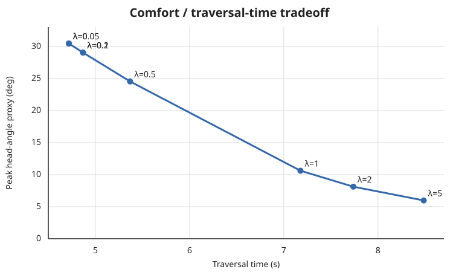

# ChauffeurCritic passenger-dynamics toy analysis

## Question

Does adding the `ChauffeurCritic` merely reduce its own mathematical cost, or does it also reduce motion in an **independent dynamical proxy for the passenger's head/neck**?

This experiment deliberately separates those two models:

1. the controller selects among vehicle trajectories using traversal time plus optional `ChauffeurCritic` cost;
2. the selected trajectory's lateral acceleration is then passed to a separate base-excited head/neck model that the controller never sees.

That makes head motion an out-of-objective consequence metric.

## Head/neck proxy

The proxy is a single rotational degree of freedom:

```text
I theta_ddot + c theta_dot + k theta = -m h a_y
```

with:

- `theta`: head angle relative to torso;
- `a_y = v * omega`: vehicle lateral acceleration;
- `m`: effective head mass;
- `h`: head-COM lever arm from the neck pivot;
- `I`: effective rotational inertia;
- `k`: rotational stiffness;
- `c`: rotational damping.

The implementation parameterizes `k` and `c` via natural frequency and damping ratio. The default toy values are:

| parameter | value |
|---|---:|
| head mass | 4.5 kg |
| COM lever arm | 0.10 m |
| rotational inertia | 0.025 kg m^2 |
| natural frequency | 2.0 Hz |
| damping ratio | 0.35 |

These values are **illustrative**. The model is a controller-evaluation proxy, not an injury or clinical whiplash predictor.

A second-order underdamped approximation is qualitatively consistent with measured human head-neck dynamics over limited operating ranges. Real neck behavior is nonlinear, posture-dependent, activation-dependent, and varies by subject.

Relevant background:

- Keshner et al., head-neck dynamics in the horizontal plane: https://pubmed.ncbi.nlm.nih.gov/12757204/
- Bronstein, second-order head/neck dynamics and damping ratio: https://pubmed.ncbi.nlm.nih.gov/2779594/
- McGill et al., passive neck stiffness in flexion/extension/lateral bending: https://pubmed.ncbi.nlm.nih.gov/23916181/
- Deng & Goldsmith, higher-order lumped head/neck/torso model: https://pubmed.ncbi.nlm.nih.gov/3611123/

## Controller-selection experiment

All candidate trajectories execute the same nominal **90 degree, 10 m-radius bend**.

Candidate variables:

- speed: 2.5 to 6.0 m/s;
- steering transition/ramp: 0.10 to 1.25 s.

The baseline selector minimizes traversal time:

```text
J_baseline = traversal_time
```

The comfort-enabled selector minimizes:

```text
J = traversal_time + lambda * log(1 + ChauffeurCritic_cost)
```

The logarithm prevents one highly discontinuous candidate from numerically overwhelming the time term while preserving the comfort-cost ordering.

### Baseline versus lambda = 1

| metric | baseline, lambda=0 | Chauffeur, lambda=1 | change |
|---|---:|---:|---:|
| selected speed | 6.0 m/s | 4.0 m/s | -33.3% |
| steering ramp | 0.10 s | 1.25 s | +1150% |
| traversal time | 4.718 s | 7.177 s | +52.1% |
| ChauffeurCritic cost | 1029.60 | 0.893 | -99.91% |
| peak head angle proxy | 30.45 deg | 10.61 deg | **-65.2%** |
| RMS head angle proxy | 17.61 deg | 7.40 deg | **-58.0%** |
| peak head angular velocity | 177.87 deg/s | 13.00 deg/s | **-92.7%** |
| peak head angular acceleration | 1422.87 deg/s^2 | 55.11 deg/s^2 | **-96.1%** |

The important result is not the large reduction in the critic's own cost. It is that the independently simulated head response also falls sharply.

## Weight sweep

The full sweep is committed in [`pareto_sweep.csv`](pareto_sweep.csv).

| lambda | speed (m/s) | ramp (s) | time (s) | peak head angle (deg) | peak head accel (deg/s^2) |
|---:|---:|---:|---:|---:|---:|
| 0.00 | 6.0 | 0.10 | 4.718 | 30.45 | 1422.87 |
| 0.05 | 6.0 | 0.10 | 4.718 | 30.45 | 1422.87 |
| 0.10 | 6.0 | 0.25 | 4.868 | 29.04 | 1157.72 |
| 0.20 | 6.0 | 0.25 | 4.868 | 29.04 | 1157.72 |
| 0.50 | 6.0 | 0.75 | 5.368 | 24.53 | 270.19 |
| 1.00 | 4.0 | 1.25 | 7.177 | 10.61 | 55.11 |
| 2.00 | 3.5 | 1.25 | 7.738 | 8.12 | 42.19 |
| 5.00 | 3.0 | 1.25 | 8.486 | 5.97 | 31.00 |

This produces the expected qualitative Pareto structure: a small comfort weight initially changes steering-rate behavior while retaining high speed; higher weights eventually trade speed for lower lateral acceleration and substantially lower head excitation.



## Interpretation

The toy experiment supports three specific claims:

1. **Steering smoothness matters independently of path geometry.** At equal speed, increasing the steering transition duration reduces high-frequency excitation substantially.
2. **Speed through curvature matters strongly.** Because `a_y = v^2 * curvature`, eventually the optimizer must reduce speed rather than merely smooth the steering transition.
3. **A stackable comfort critic can expose a tunable time-versus-passenger-motion trade.** It does not need to replace obstacle, constraint, or path-following critics.

It does **not** establish that the selected parameters are appropriate for the Jeep or that a given simulated head angle corresponds to discomfort or injury.

## Reproduce

```bash
cd extensions/nav2_chauffeur_critic/demos

python3 controller_comparison.py --check
python3 controller_comparison.py \
  --csv ../analysis/pareto_sweep.csv
```

The GitHub Action runs the assertions automatically.

## Next experiment on the Jeep

The next meaningful validation is empirical:

1. record vehicle `vx`, `wz`, steering command/angle, and IMU lateral acceleration;
2. run a repeatable slalom and 90-degree-turn course with `ChauffeurCritic` disabled;
3. repeat with several critic weights;
4. feed **measured**, not commanded, lateral acceleration into this same head/neck proxy;
5. compare traversal time, path error, vehicle jerk, head-model response, and ideally an instrumented passenger/seat IMU.

The head model should remain an external evaluation metric during this phase rather than being optimized directly. That tests whether the critic generalizes to a physically meaningful consequence it was not explicitly trained to minimize.
